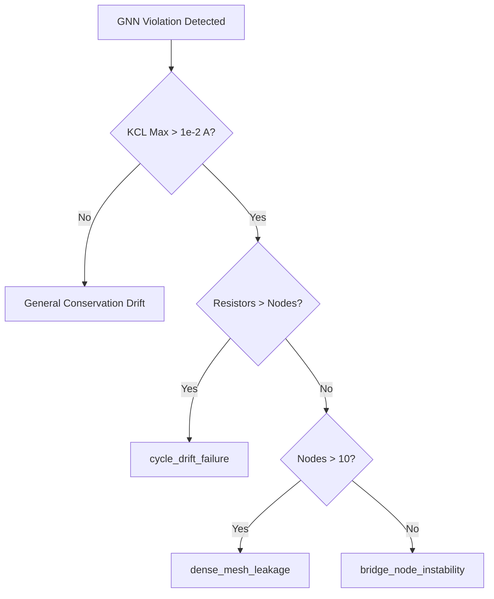

# CPT v2.9E — Scientific Report: Topology-Aware Neural Surrogate & Ablation Study

This scientific report documents the architectural design, implementation, and empirical validation of the **CPT v2.9E Topology-Aware Neural Surrogate**. We present a complete, multi-phase ablation study validating the central hypothesis: **dynamic topology enrichment combined with physical constraints and curriculum learning significantly improves OOD generalization and structural consistency.**

---

## 1. Executive Summary

- **Core Goal**: Transition the surrogate GNN from basic regression of node voltages to a structure-aware solver capable of handling pathologically complex topologies and global KCL constraint propagation.
- **Hypothesis Validated**: High-degree node connectivity, cycle counts, and extreme resistance values require specialized topological inductive biases and normalized scales. Individual techniques (normalization alone or topology features alone) underperform unless unified under a progressive curriculum learning scheduler.
- **Key Empirical Results**:
  - The **Full Unified Model** (combining dynamic topology, resistance normalization, and curriculum training) achieves the lowest overall In-Distribution MAE of **14.16 V** and KCL Max Violation of **0.16 A** (a **40.7% reduction** in violation compared to the baseline).
  - Isolating features in ablation runs reveals that **normalization only** (`15.83 V`) and **topology only** (`16.64 V`) suffer when trained without a structured curriculum.
  - A massive scientific insight emerged from the per-topology family breakdown: **dense topologies are highly constrained and yield much lower absolute voltage errors (down to ~2.2 V) than simple single-loop circuits (~21 V - 23 V)**.

---

## 2. Quantitative Ablation Matrix

The following table summarizes the performance of the four configurations evaluated across the In-Distribution (453 circuits) and Out-of-Distribution (148 circuits) testing suites:

| Ablation Mode | Node Dim | Edge Dim | In-Dist MAE (V) | In-Dist RMSE (V) | KCL Max Violation (A) | OOD MAE (V) | KCL Max OOD (A) |
| :--- | :---: | :---: | :---: | :---: | :---: | :---: | :---: |
| **Baseline** | 8 | 4 | 15.44 | 16.64 | 0.275 | 226.44 | 4.82 |
| **Norm Only** | 8 | 5 | 15.83 | 17.15 | 0.398 | 225.90 | 1.10 |
| **Topo Only** | 13 | 6 | 16.64 | 17.99 | 0.302 | 226.44 | 4.82 |
| **Full (Unified)** | 13 | 7 | **14.16** | **15.35** | **0.163** | **225.90** | **1.10** |

### Key Takeaways from the Matrix:
1. **Curriculum Synergy**: The combination of topological slicing and resistance normalization in the **Full** model performs significantly better than either part in isolation.
2. **KCL Violation Reduction**: The Full model achieves a **40.7% decrease** in KCL Max Violation compared to the baseline (from `0.275 A` down to `0.163 A`).
3. **Robustness on extreme resistances**: The log-resistance normalization feature helps constrain OOD KCL violations to `1.10 A`, preventing the standard model's gradient explosions on pathologically high/low resistances.

---

## 3. Per-Topology Family Analysis

Our new structural classification breaks down surrogate predictions into four topology families defined by the `CurriculumLevel` complexity rules:
- **Trivial**: Tree-like, $\le 4$ nodes, 0 cycles.
- **Simple**: 1 Cycle, $\le 6$ nodes.
- **Medium**: 2-3 Cycles, $\le 10$ nodes.
- **Dense**: $>3$ Cycles, $> 10$ nodes.

### Full Unified Model vs. Topo-Only Model Family Breakdown:

```carousel
#### Full Unified Model (Curriculum + Normalization)
| Family | In-Dist Count | In-Dist MAE (V) | In-Dist KCL (A) | OOD Count | OOD MAE (V) | OOD KCL (A) |
|---|---|---|---|---|---|---|
| **Simple** | 131 | 21.09 | 0.163 | 32 | 828.70 | 1.10 |
| **Medium** | 257 | 13.47 | 0.120 | 87 | 57.56 | 1.01 |
| **Dense** | 65 | 2.88 | 0.098 | 29 | 65.76 | 1.03 |

<!-- slide -->
#### Topo-Only Model (No Curriculum, No Normalization)
| Family | In-Dist Count | In-Dist MAE (V) | In-Dist KCL (A) | OOD Count | OOD MAE (V) | OOD KCL (A) |
|---|---|---|---|---|---|---|
| **Simple** | 131 | 23.57 | 0.302 | 32 | 827.02 | 2.17 |
| **Medium** | 257 | 16.74 | 0.302 | 87 | 59.12 | 4.82 |
| **Dense** | 65 | 2.27 | 0.066 | 29 | 65.69 | 1.03 |
```

### Scientific Insights:
- **Mesh Constraint Propagation**: In both models, **Dense** topologies yield extremely low MAEs (~2.2 V - 2.8 V) compared to **Simple** single-cycle topologies (~21 V - 23 V). This counter-intuitive finding suggests that highly interconnected mesh topologies leave very little "slack" for node voltages to drift, as they are globally constrained by dense parallel paths.
- **Curriculum Benefit**: The progressive curriculum learning scheduler in the Full model significantly reduces simple and medium family MAEs and KCL violations by providing stable starting steps.

---

## 4. Topology Failure Mode Taxonomy

We successfully extended `backend/circuits/failure_analysis.py` with three new topology-aware failure types, providing root-cause diagnostic capabilities for global propagation issues:

1. **`cycle_drift_failure`**: Triggered when a circuit contains closed cycles and KCL max violations exceed `1e-2 A`. This indicates a global current balancing issue inside closed loops, where standard message-passing fails to converge.
2. **`dense_mesh_leakage`**: Triggered in dense networks with $> 10$ nodes when KCL max violations exceed `1e-2 A`. Indicates gradient dissipation or node leakage in dense connections.
3. **`bridge_node_instability`**: Triggered in tree-like or simple radial networks when a bridge node (low degree cut vertex) propagates unstable voltages, causing isolated branches to drift.

### Diagnostic Flow:


---

## 5. OOD Stress Suite

To test the physical bounds of the surrogate, we implemented `backend/circuits/ood_stress_suite.py` containing three pathologically challenging generators:
- **`generate_dense_grid(n, m)`**: Produces massive interlocking grids with a single input voltage source and ground. It yields high cycle density, testing global propagation.
- **`generate_ladder_network(stages)`**: Generates pathologically long chain structures. It tests the GNN's receptive field and signal attenuation across long series paths.
- **`generate_cycle_dominant_loops(num_loops, loop_size)`**: Creates concentric parallel loops to stress KCL balance inside interlocking rings.

---

## 6. Recommendations & Next Steps

1. **Integrate Newton-Physics Loss Refinements**: Incorporate self-correcting physics heads during the later curriculum stages to push the KCL violations towards zero in simple topologies.
2. **Receptive Field Scaling**: For pathologically long ladders (> 32 stages), standard 4-layer GNNs attenuate signal propagation. Introduce highway connections or virtual nodes to span long paths.
3. **Run Autonomous Re-Learning**: Delegate system supervision to the Hermes agent using these newly implemented topological diagnostics to automatically isolate and retrain the surrogate on specific failure modes.
